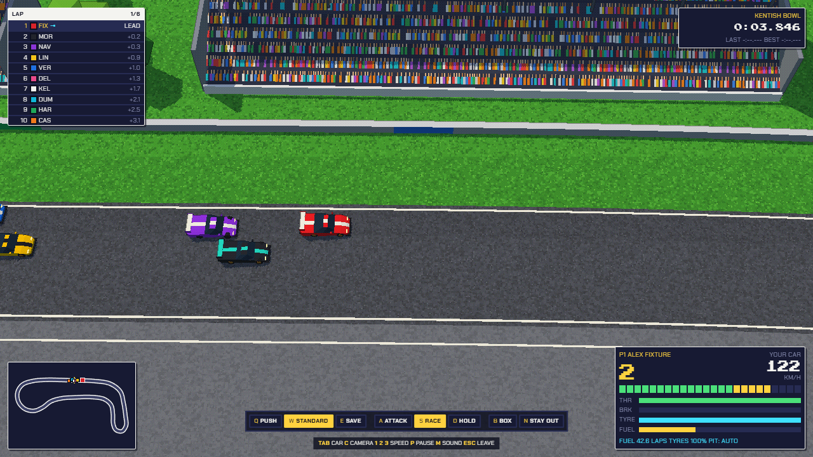
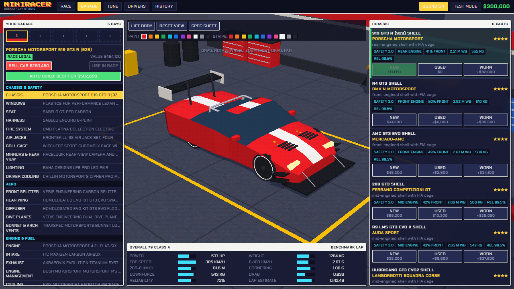
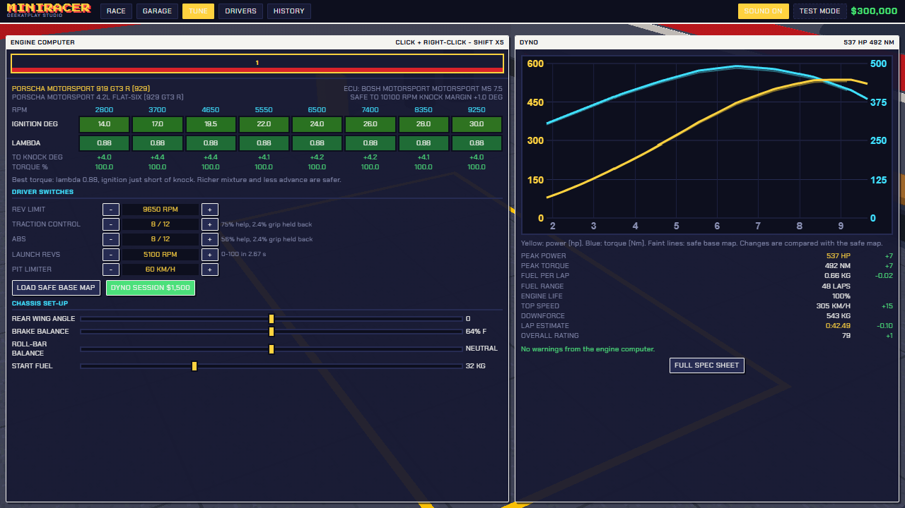
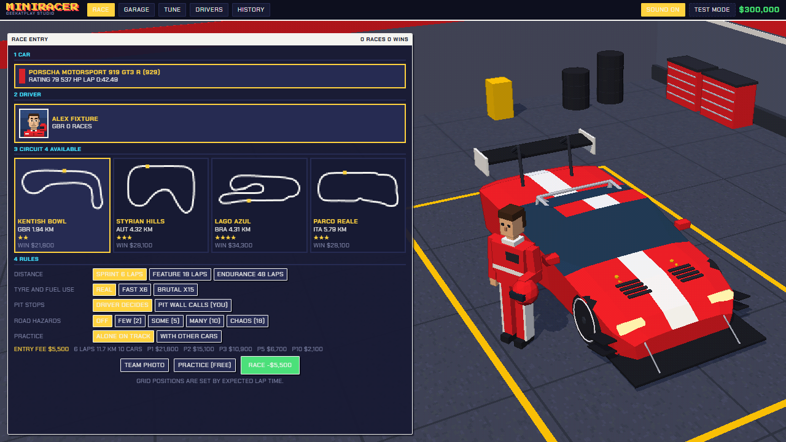
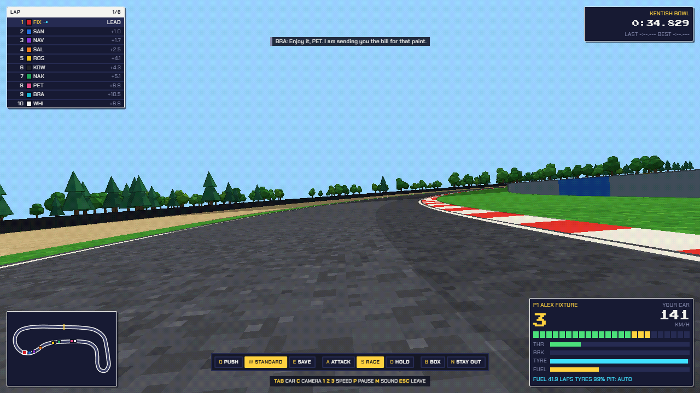

# MiniRacer

**A 16-bit style racing team game by Geekatplay Studio.**

You do not steer the car. You build it, part by part, in a 3D garage; you create the driver who races it; then you run the race from the pit wall. Prize money buys better parts.



## What is in the game

**Build the car**

- 331 parts in 63 slots from many makers: shell, engine, internals, turbo, gearbox, suspension, brakes, tyres, aero, electronics and more.
- Every part changes the car the physics runs: power, weight, grip, drag, downforce, reliability, pit-stop time.
- New, used or worn parts at different prices.
- Auto build picks the best parts your budget buys.
- An overall rating, class and full spec sheet for every car.

**Program the engine computer**

- Ignition, fuel and boost maps on an eight-point rev grid.
- Knock limits, a dyno graph, fuel use and reliability that follow your map.
- Driver switches: rev limit, traction control, ABS, launch revs.

**Create the driver**

- 100 skill points to spread across reaction, anticipation, car control, braking, discipline and more.
- Temperament (aggression, risk) and weight all change how the driver behaves on track.
- Twelve appearance options and a team photo beside the car.

**Race**

- Four circuits, three race distances, and a tyre and fuel wear setting.
- Pit stops called by the driver or by you. Run out of fuel or wear a tyre through and the car retires.
- Pit-wall orders: push, save, attack, hold, box, stay out. A hot-headed driver may not listen.
- Random road hazards: oil, loose tyres, debris, animals, crashed cars.
- Collisions leave visible damage and cost a little speed; cars recover and carry on. Pit stops repair part of it.
- Going off the track wears the tyres much faster and leaves them dirty for a few corners.
- Three cameras: chase, driver's eye, whole circuit.
- Synthesised engine, tyre and impact sound, with a mute button (or press `M`).
- Race history, career statistics and a photo album.

| Garage | Engine computer |
| --- | --- |
|  |  |

| Race entry | Driver's-eye view |
| --- | --- |
|  |  |

## Run it

You need [Node.js](https://nodejs.org) 20 or newer.

```bash
npm install
npm run dev
```

Then open http://localhost:5173.

To make a production build:

```bash
npm run build
npm run preview
```

## Controls

| Key | Action |
| --- | --- |
| `Tab` / `Shift+Tab` | Follow the next or previous car |
| `Home` | Back to your car |
| `C` | Camera: chase, driver's eye, circuit |
| `1` `2` `3` `4` | Race speed: 1x, 2x, 4x, 8x |
| `P` or `Space` | Pause |
| `M` | Sound on or off |
| `Esc` | Leave the race |
| `Q` `W` `E` | Pace: push, standard, save |
| `A` `S` `D` | Stance: attack, race, hold position |
| `B` `N` | Box this lap, stay out |

## How it is built

- **TypeScript**, **Three.js** and **Vite**. No game engine and no art files: every model, texture and sound is made in code.
- The simulation runs at a fixed 240 steps a second and is fully deterministic: the same seed and the same orders always give the same race.
- The look comes from rendering to a low-resolution frame, then outlining and dithering it to a limited palette.

```
src/
  sim/      physics, racing line, driver behaviour, race rules (no browser or rendering code)
  game/     car building, engine computer, team profile, race set-up
  data/     parts catalogue, cars, circuits, names
  render/   3D scenes, car models, effects, pixel pipeline
  audio/    synthesised sound
  ui/       screens and race overlay
tests/      unit and integration tests (Vitest)
e2e/        browser tests (Playwright)
```

## Tests

```bash
npm run check      # type check, lint, unit and integration tests
npm run test:e2e   # browser tests (uses the installed Microsoft Edge)
```

## Names

All car, maker and circuit names shown in the game are invented. MiniRacer is not affiliated with or endorsed by any manufacturer, team, series or circuit.

## Credits

Created by **Vladimir Chopine**, [Geekatplay Studio](https://github.com/GeekatplayStudio).

Copyright © 2026 Geekatplay Studio, Vladimir Chopine. All rights reserved.
