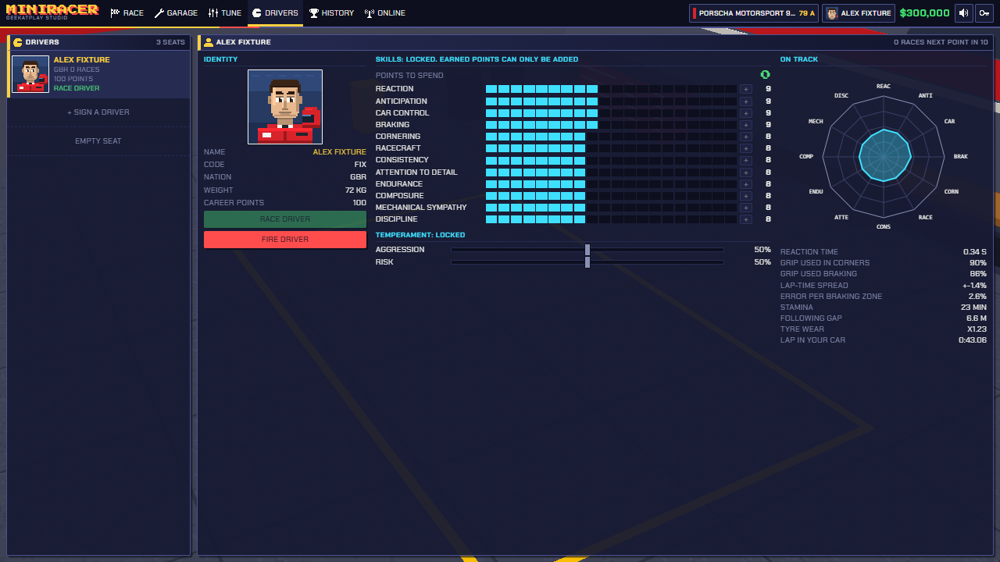
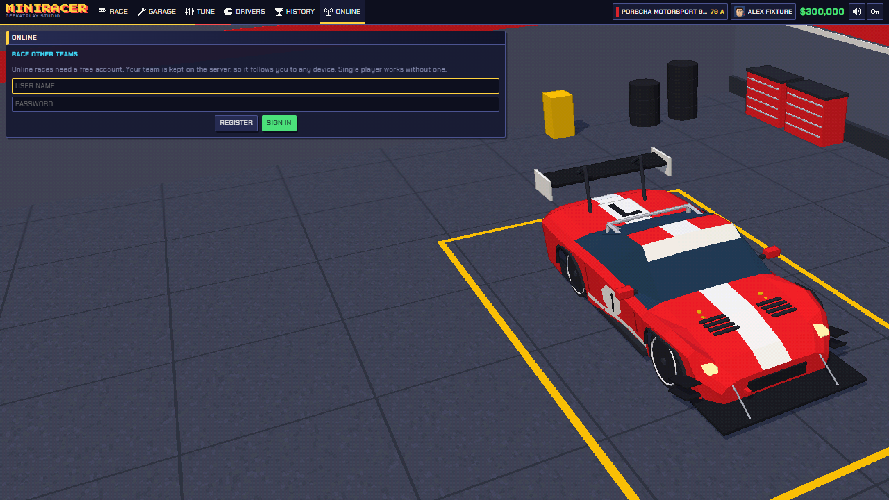

# MiniRacer

**A 16-bit style racing team game by Geekatplay Studio.**

You do not steer the car. You build it, part by part, in a 3D garage; you create the driver who races it; then you run the race from the pit wall, alone or online against other teams. Prize money buys better parts.


## What is in the game

**Build the car**

- 331 parts in 63 slots from many makers: shell, engine, internals, turbo, gearbox, suspension, brakes, tyres, aero, electronics and more.
- Every part changes the car the physics runs: power, weight, grip, drag, downforce, reliability, pit-stop time.
- New, used or worn parts at different prices.
- Auto build picks the best parts your budget buys.
- An overall rating, class and full spec sheet for every car.

**Program the engine computer**

- Ignition, fuel and boost maps on an eight-point rev grid.
- Knock limits, a dyno graph, fuel use and reliability that follow your map.
- Driver switches: rev limit, traction control, ABS, launch revs.

**Create the driver**

- 100 skill points to spread across reaction, anticipation, car control, braking, discipline and more.
- Temperament (aggression, risk) and weight all change how the driver behaves on track.
- Twelve appearance options and a team photo beside the car.
- Drivers' faces pop up on the radio when they call in, or when they have something to say about a rival.

**Race**

- Thirteen circuits based on real layouts, from short and twisty to long and fast, with invented names.
- Weather: dry, showers with puddles, or light snow. The track loses grip and drivers lift to suit.
- Three race distances, and a tyre and fuel wear setting.
- Pit stops called by the driver or by you. Run out of fuel or wear a tyre through and the car retires.
- Pit-wall orders: push, save, attack, hold, box, stay out. A hot-headed driver may not listen.
- Random road hazards: oil, loose tyres, debris, animals, crashed cars.
- Collisions leave visible damage and cost a little speed; cars recover and carry on. Pit stops repair part of it.
- Going off the track wears the tyres much faster and leaves them dirty for a few corners.
- Three cameras: chase, driver's eye, whole circuit.
- Synthesised engine, tyre and impact sound, with a mute button (or press `M`).
- Race history, career statistics and a photo album.

**Race online**

- Create a free account; your team is kept on the server and follows you to any device.
- Open a game, choose the circuit, laps, rules and weather, and how many of the seats are for people. The rest are filled by computer drivers.
- Other players see the game in the lobby and join; when every player is ready, the race starts.
- The server runs the race, so every player sees the same race, and each player can give orders only to their own car.
- Prize money from online races is paid into your saved team.

| Garage | Engine computer |
| --- | --- |
|  |  |

| Race entry | Driver's-eye view in the snow |
| --- | --- |
|  |  |

| Drivers | Online |
| --- | --- |
|  |  |

## Run it

You need [Node.js](https://nodejs.org) 22 or newer.

```bash
npm install
npm run dev
```

Then open http://localhost:5173.

Single player works with no server.

### With online play

Build the game and the server, then start the server. It serves the game and the online lobby on one port:

```bash
npm run build
npm run build:server
npm start
```

Then open http://localhost:8787. [DEPLOY.md](DEPLOY.md) explains how to put it on your own server, including the settings, where player data is kept and how to back it up.

For development with live reloading, run the server with `CORS_DEV=1 npm start`, run `npm run dev` beside it, and open http://localhost:5173/?server=http://localhost:8787.

## Controls

| Key | Action |
| --- | --- |
| `Tab` / `Shift+Tab` | Follow the next or previous car |
| `Home` | Back to your car |
| `C` | Camera: chase, driver's eye, circuit |
| `1` `2` `3` `4` | Race speed: 1x, 2x, 4x, 8x |
| `P` or `Space` | Pause |
| `M` | Sound on or off |
| `Esc` | Leave the race |
| `Q` `W` `E` | Pace: push, standard, save |
| `A` `S` `D` | Stance: attack, race, hold position |
| `B` `N` | Box this lap, stay out |

## How it is built

- **TypeScript**, **Three.js** and **Vite**. No game engine and no art files: every model, texture and sound is made in code.
- The simulation runs at a fixed 240 steps a second and is fully deterministic: the same seed and the same orders always give the same race.
- The look comes from rendering to a low-resolution frame, then outlining and dithering it to a limited palette.
- The online server is plain Node.js with one dependency (`ws`). Accounts and teams are stored as files; passwords are salted and hashed with scrypt.

```
src/
  sim/      physics, racing line, driver behaviour, race rules (no browser or rendering code)
  game/     car building, engine computer, team profile, race set-up
  data/     parts catalogue, cars, circuits, names
  render/   3D scenes, car models, effects, pixel pipeline
  audio/    synthesised sound
  ui/       screens and race overlay
  net/      online play: account and lobby client, race snapshots
server/     online server: accounts, lobby, races
tests/      unit and integration tests (Vitest)
e2e/        browser tests (Playwright)
```

## Tests

```bash
npm run check      # type check, lint, unit and integration tests
npm run test:e2e   # browser tests (uses the installed Microsoft Edge)
```

## Names

All car, maker and circuit names shown in the game are invented. MiniRacer is not affiliated with or endorsed by any manufacturer, team, series or circuit.

## Credits

Created by **Vladimir Chopine**, [Geekatplay Studio](https://github.com/GeekatplayStudio).

Most circuit layouts are derived from the centre lines in the [TUMFTM racetrack database](https://github.com/TUMFTM/racetrack-database) (LGPL-3.0), simplified and adjusted for the game.

Copyright © 2026 Geekatplay Studio, Vladimir Chopine. All rights reserved.
